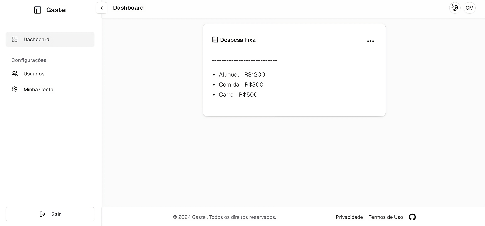

# 💸 Gastei
> Este projeto consiste em uma interface web intuitiva e funcional para o controle de finanças pessoais via cards. Desenvolvido com foco em simplicidade e organização, o Gastei permite aos usuários cadastrar, visualizar, editar e acompanhar suas despesas de forma prática e eficiente.



## 💻 Pré-requisitos

Antes de começar, verifique se você atendeu aos seguintes requisitos:

- Você instalou a versão mais recente de `nodejs`.
- Você tem uma máquina `Windows / Linux / Mac`.

## 🚀 Instalando o Gastei

Para instalar o Gastei, siga estas etapas:

Windows / Linux / Mac:

Clone o repositório e entre na pasta principal do projeto.

Navegue até a pasta gastei-front e execute o comando para instalar as dependências do frontend:

```
npm install
```

Agora, para iniciar o projeto, utilize os seguintes comandos:


```
npm run dev
```

O frontend estará rodando na porta `3000`.